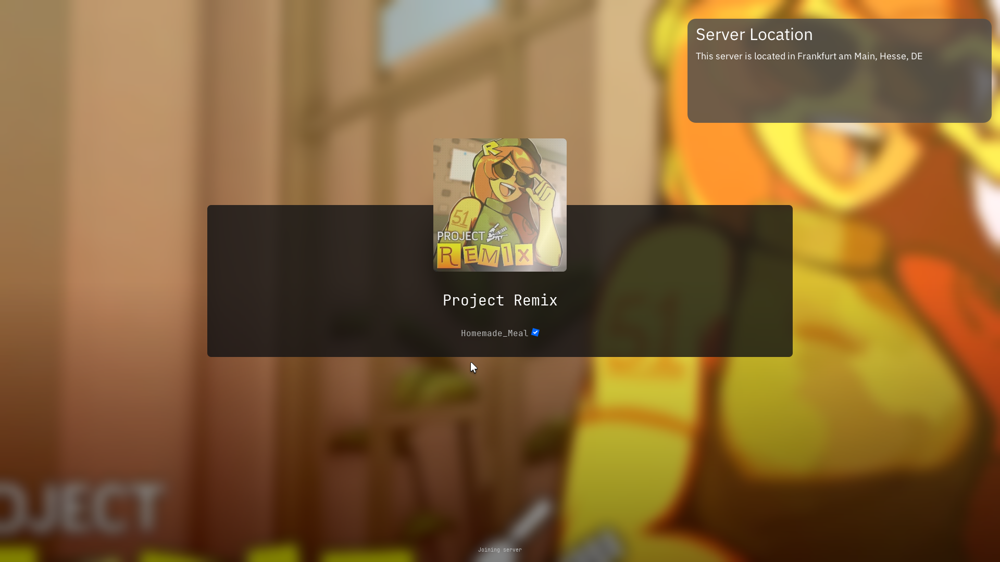

#  Lucem
Lucem is a small wrapper over [Sober](https://sober.vinegarhq.org) to provide some QoL improvements. \
Please keep in mind that while Lucem is fully open source software, Sober is proprietary for a very good reason, that being to preserve RoL from 9-year-old skiddies.




# Contact/Support
You can open issues for bugs. \
We now have a Discord server! You can join it [here](https://discord.gg/Z5m3n9fjcU)

# Disclaimer, in big bold letters.
Lucem does not allow you to bypass the (reasonable and justified) restrictions the Vinegar team has put on Sober's ability to load APKs that are modified.

If you really cheat on Roblox, I'd say you should reconsider your life decisions than anything. \
**Lucem is not associated with the VinegarHQ team or Roblox, nor is it endorsed by them!**

# Features
- GTK4 + Libadwaita GUI to modify settings
- GTK4-based FFlag editor that is easy to use
- Rich presence
- Server region notifier
- Game overlay
- If you're not a fan of GUIs, we provide a nifty configuration file that does the same thing! (located at `~/.config/lucem/config.toml`, or you can run `lucem edit-config`!)
- Managing Sober

Whilst not a feature you use directly, Lucem also caches API calls whenever it can in order to save bandwidth and resources.

# Icon
The Lucem icon is made by [AshtakaOOf](https://github.com/AshtakaOOf). It is located [here](src/assets/lucem.svg). \
You are free to use it wherever you want.

## Patches
Lucem provides the following optional patches. All of them go under the `tweaks` section in your configuration.

### Bring back the old Oof sound
```toml
oldOof = true
```

### Use another font
Both OTFs and TTFs are supported.
```toml
font = "/path/to/your/font.ttf"
```

### Replace sun and moon
```toml
sun = "/path/to/sun.jpeg"
moon = "/path/to/moon.jpeg"
```

### Force X11 or Wayland to be used
This one goes in the `client` section!
```toml
[client]
backend = "x11" # or "wayland", "wl". This is case insensitive.
```

# Installation
## Building from source
You will need the following dependencies to compile Lucem:

### Arch
```command
# pacman -S gtk4 libadwaita nim git
```

### Fedora
```command
# dnf install gtk4-devel libadwaita-devel git
```
Fedora currently has no nim package, install Nim [here](https://nim-lang.org/install_unix.html)

### Debian
```command
# apt install gtk4 libadwaita-1-0 libadwaita-1-dev git
```
Debian ships an old version of Nim that is not compatible with Lucem, install Nim [here](https://nim-lang.org/install_unix.html)

### NixOS
There's no Nix flake yet.
```command
$ git clone https://github.com/xTrayambak/lucem
$ cd lucem
$ nix-shell
```

The package names are similar for other distributions.

Run the following command to compile Lucem.
```command
$ nimble install https://github.com/xTrayambak/lucem
```

# Submitting bug reports
Please make sure to attach the logs that Lucem generates. Also, please run Lucem with the verbose flag (`lucem run -v`) and submit that log as it contains crucial debugging informationt.

# Usage
## Launching the Lucem GUI
```command
$ lucem shell
```

## Configuring Lucem
```command
$ lucem edit-config
```

This will open the configuration file in your preferred editor. Your configuration will immediately be validated after you exit the editor.

## Launching Roblox
```command
$ lucem run
```

## Check build metadata
```command
$ lucem meta
```

## Clearing API caches
```command
$ lucem clear-cache
```

## Installing Desktop File
```command
$ lucem install-desktop-file
```

## Installing Systemd Service (run as user, not root!)
```command
$ lucem install-systemd-service
```

# Troubleshooting

## It says `lucem: command not found` after compiling!
The nimble binary folder is not in your PATH, you can run:
```command
$ export PATH=/home/your_username/.nimble/bin:$PATH
```
You will need to add this to your .bashrc to make this permanent.
